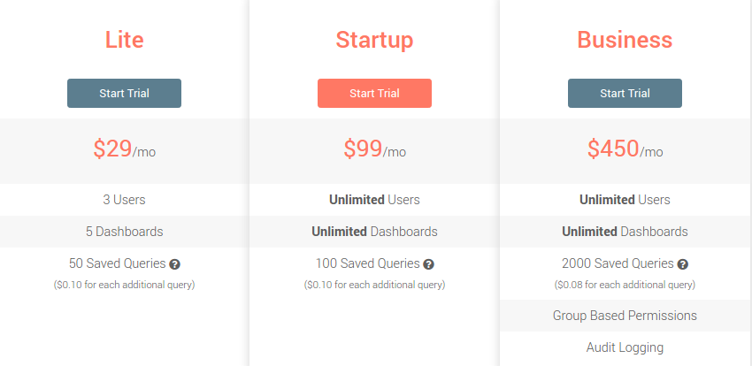

# Analysis

The analysis of the data needs to be flexible and easy to change. Creating from scratch an analysis tool is quiet complicated has the tool needs to be abstract enough to not block the user. For this reason it makes sense to delegate the analysis to other tools.
One idea is to create an Elasticsearch database which map the Postgres database so user can quickly search and extract the data and use [Kibana](https://www.elastic.co/products/kibana) to build analysis.

A better and quicker solution is to use [Redash](https://redash.io). Redash can automatically extract the data from Postgress and can be used to quickly build relatively complex queries.

An intermediate solution is to have the main analysis tables "hard coded" in the application, this will allow users to quickly access to some popular and often used analysis but they won't be able to modify them.

## Estimations:

### Hard coded analysis 10 days + 1/2 day per query

We can integrate specific queries and graphs into the app but these queries won't be customisable.

Main steps

  - Build the sql query which extract the right information, if the structure of the database is well defined the creation of the query shouldn't be too comlicated
  - Learn and implement [d3](http://d3js.org) or [chartjs](http://www.chartjs.org/) to display the graphs
  - UI, html and css work to integrate properly the graphs

### Elasticsearch + Kibana - 10 Days

Build a process/cron which extract the data from Postgress and add it to Elasticsearch. We can use either AWS Lambda or Heroku Cron

Main steps for this process:
  - loop over the tables
  - match the type of the tables to Elasticsearch structure
  - avoid copying existing data in Elasticsearch (duplicates)
  - deploy the script on AWS/Heroku
  - Tests the script
  - Create Kibana tutorial to explain Safe Lives on how to use it.

### Redash - 4 days or 8 days self hosted

Self hosted Redash might be cheaper on a long term but it will take more developer time to run. From the safe lives point of view it might be worse to try the paid version of Redash first.

Connecting a Postgress database is very easy and the UI is very intuitive.

Main steps:

 - Create a Redash account
 - Create sql tutorial to explain how to extract data and create graph - 2 days (could we create dwyl youtube tutorial?)

 Redash automatically shares the queries with other users of an organisation.
