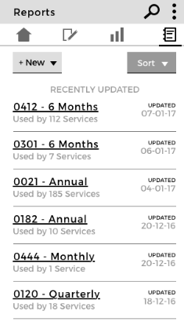

# Reports

A report is a group of analysis tables with descriptions and text explanation attached to them. A Safe Lives Admin needs to be able to update and send reports to specific services and other user. For that the reports needs to update the analysis tables automatically depending of a specific timeline and filters (services, roles,...)

## Main features:

As a safe lives admin:

- I can see the a list of all the reports
- I can sort the list of reports by date of creation
- I can create a new report
